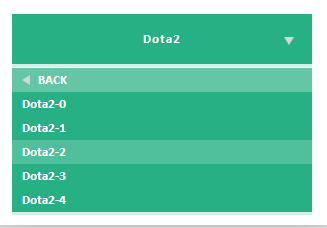

# petrus_select 下拉控件

标签（空格分隔）： 控件 CSS3 jQuery 前端

---

## 关于petrus_select
> * 下拉控件
> * 下载：https://github.com/pyrinelaw/petrus_select

## 调用

### 引用css
```css
<link rel="stylesheet" href="src/css/petrus-select.css" />
```

### 引用js
```javascript
<script type="text/javascript" src="src/lib/jquery-1.11.2.min.js"></script>
<script type="text/javascript" src="src/js/petrus-select-0.1.0.js"></script>
```

### 参数

```javascript
defaultOptions = {
	width: NaN,				// 自定义宽度，不定义随外部容器而变化
	// 样式名,blue对应样式为petrus-blue-select, (blue、white、pink、green、grey、black)
	styleName: 'blue',
	title: '请选择',			// 标题
	backText: 'BACK',		// 返回字体
	$container: null,		// 容器
	selected: [],			// 当前选中
	data: {},				// 数据，格式如:{k1: [v1, v2], k2: ...}
	callbacks: {
		init: null,			// 初始化完成回调
		titClicked: null,	// 点击标题回调
		change: null		// 选中分类改变回调
	}
}
```

### 自定义样式

在petrus-select.css参考如下样式

```css
.petrus-blue-select *{ color: #FFF; }
.petrus-blue-select .petrus-select-tit{ background: #2ECBD8; box-shadow: 0px 3px 0px rgba(46, 203, 216, 0.2); font-weight: bold; }
.petrus-blue-select .petrus-select-list-wrap{background: #2ECBD8; box-shadow: 0px 3px 0px rgba(46, 203, 216, 0.2); font-weight: bold; }
```

以上这段代码对应的是blue样式。(options.styleName)
如有需要，请自行添加

### 返回
```javascript
{
	selected: [Array]     // 当前选中
}
```

### 调用示例

```javascript
$.petrus_select({
    $container: $('.demo'),
    data: {
            'Naruto': ['Naruto-0', 'Naruto-1', 'Naruto-2'],
            'Dota2': ['Dota2-0', 'Dota2-1', 'Dota2-2', 'Dota2-3', 'Dota2-4'],
            'Cartoon': ['Cartoon-0', 'Cartoon-1', 'Cartoon-2'],
            'Gintama': []
    },
    callbacks: {
        init: function(){
            console.info("初始化完成");
        },
        change: function(selected){
            console.info("选中值发生变化");
            console.info(selected);
        },
        titClicked: function(){
            console.info("title点击回调");
        }
    }
});
```

或者

```javascript
$('.demo').petrus_select({
    ......
});
```

------



------
感谢您花费时间阅读这份文稿
更多插件请访问： https://github.com/pyrinelaw
作者：Petrus.Law

------

**Demo:** [http://pyrinelaw.github.io/petrus-select](http://pyrinelaw.github.io/petrus-select)
**Download:** [https://www.github.com/pyrinelaw/petrus-select](https://www.github.com/pyrinelaw/petrus-select)
